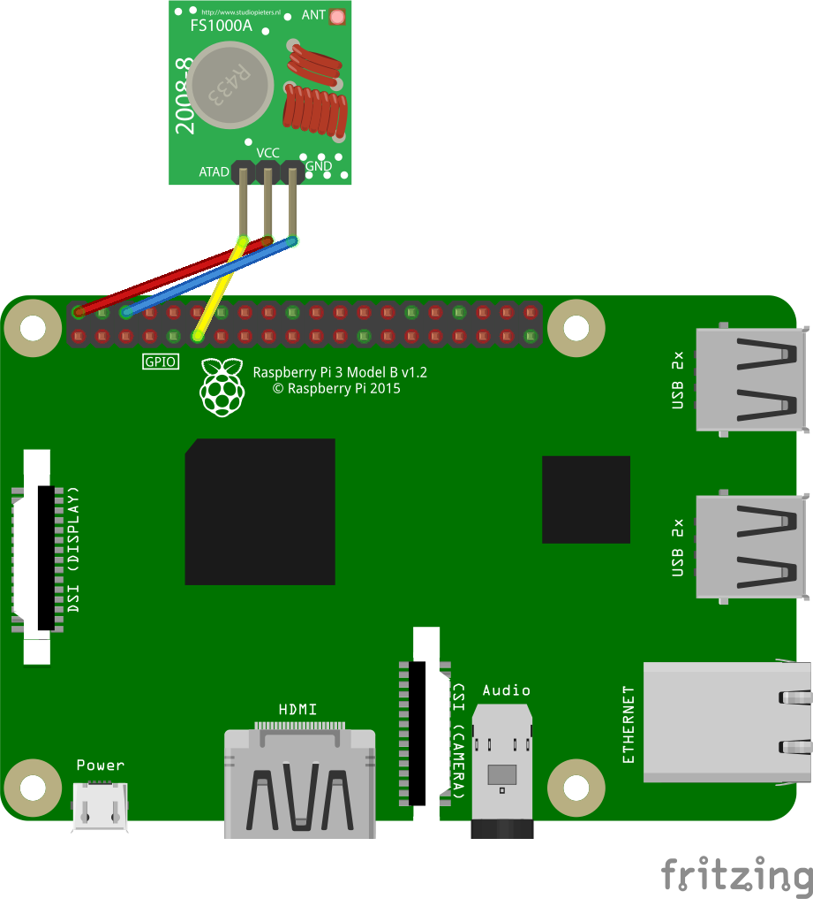

# Hama wireless socket 00108830
A very simple sender program for hama 00108830 wireless socket written in python for the raspberry pi. 

## Setup
Connect as shown in the picture
DATA to GPIO17 (default)


Transmitter graphic is under MIT license.
## Run script
```
./hamasender.py <buttonnr> <on|off>
```

for example
```
./hamasender.py 1 on
```
or
```
./hamasender.py all off
```
